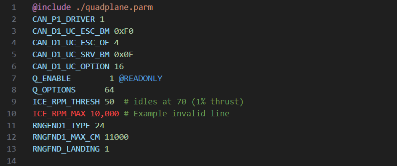

# ArduPilot Parameter File Syntax Highlighter for VSCode

This extension provides syntax highlighting for ArduPilot parameter files
(`.parm`/`.param`), making it easier to work with configuration files in VSCode.
It highlights parameter names, values, comments, and special directives
(`@include`, `@READONLY`).

## Features

- **Parameter Line Highlighting:** Supports highlighting of parameter names,
  values (numeric, hex, binary, and quoted strings), optional `@READONLY` tag,
  and comments.
- **Error Detection:** Invalid lines that do not follow the expected format are
  highlighted as errors, helping catch mistakes.

## Installation from GitHub

1. Download the latest `.vsix` file from the releases.
2. Open VSCode and go to the Extensions view (`Ctrl+Shift+X`)
3. Click the `...` icon in the top-right corner and select `Install from
   VSIX...`
4. Choose the downloaded `.vsix` file

## License

This extension is licensed under the [The Unlicense](https://unlicense.org).
